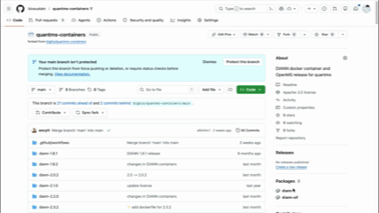

# QuantMS Docker Containers

A repository of production-ready Docker and Singularity containers for proteomics tools used in quantms pipelines, including **DIA-NN**, **Relink**, and **OpenMS**.

## Overview

This repository provides containerized versions of popular proteomics tools:

- [DIA-NN](https://github.com/vdemichev/DiaNN): A powerful software solution for analyzing DIA proteomics data
- [Relink](https://github.com/bigbio/relink): Crosslinking mass spectrometry analysis pipeline (xiSEARCH, xiFDR, Scout)
- [OpenMS](https://www.openms.de/): A versatile open-source software for mass spectrometry data analysis
- [WiffConverter](https://hub.docker.com/r/sciex/wiffconverter): SCIEX `.wiff` / `.wiff.scan` to indexed `.mzML` conversion via the bundled `OneOmics.WiffConverter` .NET assembly

These containerized versions offer:

- Simplified installation and deployment
- Consistent runtime environment across platforms
- Pre-configured dependencies and optimizations
- Automatic builds and releases via GitHub Actions
- Both Docker and Singularity container formats

## Container Availability

### DIA-NN Containers

**Important**: Due to licensing restrictions, DIA-NN containers are not publicly distributed. Users must build these containers locally or have access to the private `ghcr.io/bigbio/diann` registry.

| Version | Directory      | Key Features                                  | Container Tag                |
| ------- | -------------- | --------------------------------------------- | ---------------------------- |
| 1.8.1   | `diann-1.8.1/` | Core DIA-NN, library-free analysis            | `ghcr.io/bigbio/diann:1.8.1` |
| 1.9.2   | `diann-1.9.2/` | QuantUMS quantification, redesigned NN        | `ghcr.io/bigbio/diann:1.9.2` |
| 2.0.2   | `diann-2.0.2/` | Parquet output, proteoform confidence         | `ghcr.io/bigbio/diann:2.0.2` |
| 2.1.0   | `diann-2.1.0/` | Native `.raw` on Linux (bundles .NET SDK 8)   | `ghcr.io/bigbio/diann:2.1.0` |
| 2.2.0   | `diann-2.2.0/` | Native `.raw` on Linux (bundles .NET SDK 8)   | `ghcr.io/bigbio/diann:2.2.0` |
| 2.3.2   | `diann-2.3.2/` | Native `.raw` on Linux (bundles .NET SDK 8)   | `ghcr.io/bigbio/diann:2.3.2` |
| 2.5.0   | `diann-2.5.0/` | Native `.raw` on Linux (bundles .NET SDK 8)   | `ghcr.io/bigbio/diann:2.5.0` |
| 2.5.1   | `diann-2.5.1/` | Native `.raw` on Linux (bundles .NET SDK 8)   | `ghcr.io/bigbio/diann:2.5.1` |
| 2.5.1 Enterprise | `diann-enterprise-2.5.1/` | Knowledge Base (`--kb`), extra report QC metrics. **Per-user license; built locally only (no CI / registry push).** | `ghcr.io/bigbio/diann-enterprise:2.5.1` |

> **Native Thermo `.raw` support (DIA-NN ≥ 2.1.0).** Starting with 2.1.0, DIA-NN
> can read Thermo `.raw` files directly on Linux via bundled `RawWrapper.dll` /
> `ThermoFisher.CommonCore.*` libraries (targeting `net8.0`). At startup
> DIA-NN runs `dotnet --list-sdks` and, if no SDK is found, aborts with
> `ERROR: cannot read .raw files, please download and install .NET Runtime
> 8.0.14 or later`. The 2.1.0 / 2.2.0 / 2.3.2 / 2.5.0 / 2.5.1 (incl. Enterprise)
> images therefore install `dotnet-sdk-8.0` (from Ubuntu 22.04 `jammy-updates`);
> no extra action is
> needed. DIA-NN ≤ 2.0.2 does **not** ship the Thermo reader on Linux and
> still requires external conversion (e.g. ThermoRawFileParser → `.mzML`).

```bash
# Build Docker container locally
cd diann-2.1.0/
docker build -t diann:2.1.0 .

# Build Singularity container from Docker
singularity build diann-2.1.0.sif docker-daemon://diann:2.1.0
```

#### DIA-NN Enterprise (local-only)

The Enterprise image (`diann-enterprise-2.5.1/`) is built from a **local**
enterprise zip plus a **per-licensee** `diann-license-key.txt`. Neither artefact
is committed (both are `.gitignored`) and the image is **never** pushed to a
registry — it has no CI entry. The license key is a per-user secret: do not
redistribute it or bake it into a shared image.

```bash
# ENTERPRISE_SRC must point at the directory holding the zip + license key
ENTERPRISE_SRC=/path/to/enterprise ./build-diann-enterprise-singularity.sh
```

This produces `ghcr.io/bigbio/diann-enterprise:2.5.1` locally and the matching
Singularity `.img`. In [quantmsdiann](https://github.com/bigbio/quantmsdiann),
select it with `-profile diann_v2_5_1_enterprise`; the Knowledge Base is enabled
via `--enable_kb` and boosts identifications (primarily on human data).

### Relink Container

The Relink container provides a complete crosslinking mass spectrometry analysis environment.

| Component    | Version | Description                             |
| ------------ | ------- | --------------------------------------- |
| xiSEARCH     | 1.8.11  | Crosslink identification search engine  |
| xiFDR        | 2.3.10  | FDR estimation for crosslinked peptides |
| Scout        | 2.1.0   | Crosslink analysis tool                 |
| xi-mzidentml-converter | latest | mzIdentML parsing package (CLI: `process_dataset`) |
| pyOpenMS     | latest  | Python bindings for OpenMS              |
| .NET Runtime | 9.0     | Required by Scout                       |
| Java JRE     | 21      | Required by xiSEARCH and xiFDR          |

| Container Type | Tag    | URL                                      |
| -------------- | ------ | ---------------------------------------- |
| Docker         | 1.1.0  | `ghcr.io/bigbio/relink:1.1.0`            |
| Docker         | latest | `ghcr.io/bigbio/relink:latest`           |
| Singularity    | 1.1.0  | `oras://ghcr.io/bigbio/relink-sif:1.1.0` |

All bundled tools are exposed directly on `PATH`:

| Command           | Tool                                                          |
| ----------------- | ------------------------------------------------------------- |
| `scout`           | Scout (cleavable XL-MS search)                                |
| `xisearch`        | xiSEARCH                                                      |
| `xifdr`           | xiFDR                                                         |
| `process_dataset` | xi-mzidentml-converter (already on PATH from the pip package) |

The `scout` wrapper handles Scout's startup quirks transparently (Python detection, `LD_LIBRARY_PATH` for MPFR/GMP, CSMSL user-data dir).

#### Passing JVM options to xiSEARCH / xiFDR

Use `--java-options "..."` (GATK convention) to pass JVM flags such as `-Xmx`, `-Xms`, `-XX:...`, or `-D...`. All flags go inside a single space-separated quoted string. This survives the layered quoting in Nextflow / Singularity / Docker pipelines without escape pain. The flag may be repeated to append.

```bash
# Pull the image
docker pull ghcr.io/bigbio/relink:latest

# Scout end-to-end (mount data + params under /data)
docker run --rm -v /path/to/data:/data ghcr.io/bigbio/relink:latest \
  scout -search -no_filter /data/search_params.json /data/filter_params.json

# xiSEARCH with a 16 GB heap
docker run --rm -v /path/to/data:/data ghcr.io/bigbio/relink:latest \
  xisearch --java-options "-Xmx16g" \
           --config=/data/config --peaks=/data/peaks.mgf \
           --fasta=/data/db.fasta --output=/data/results.csv

# xiFDR with custom heap and G1 GC
docker run --rm -v /path/to/data:/data ghcr.io/bigbio/relink:latest \
  xifdr --java-options "-Xmx8g -XX:+UseG1GC" --psmfdr=0.05 /data/results.csv

# xi-mzidentml-converter
docker run --rm -v /path/to/data:/data ghcr.io/bigbio/relink:latest \
  process_dataset --help
```

#### Nextflow

`--java-options` keeps everything on one line — no extra escaping inside the script block:

```groovy
process XISEARCH {
    container 'ghcr.io/bigbio/relink:1.1.0'
    cpus 4
    memory '16 GB'
    script:
    """
    xisearch --java-options "-Xmx${task.memory.toGiga()}g" \\
             --config=${config} --peaks=${peaks} --fasta=${fasta} \\
             --output=xisearch_results.csv
    """
}
```

For Scout's CLI flags and params-file structure, see https://github.com/diogobor/Scout#26-automation.

### WiffConverter Container

The WiffConverter container wraps the upstream [`sciex/wiffconverter`](https://hub.docker.com/r/sciex/wiffconverter) image (bundles Mono + `OneOmics.WiffConverter.exe`) and adds a small `convert` CLI on `PATH`. It is used by [quantmsdiann](https://github.com/bigbio/quantmsdiann) to ingest AbSciex data natively (`.wiff` + companion `.wiff.scan` → indexed `.mzML` in one step, no separate indexing pass). The output is always an `indexedmzML` (the converter is invoked with `--index`).

| Container Type | Tag  | URL                                           |
| -------------- | ---- | --------------------------------------------- |
| Docker         | 0.10 | `ghcr.io/bigbio/wiffconverter:0.10`           |
| Singularity    | 0.10 | `oras://ghcr.io/bigbio/wiffconverter-sif:0.10` |

`0.10` tracks the latest tag published by SCIEX on Docker Hub (2019-05-17).

```bash
# Convert a SCIEX .wiff (with its .wiff.scan next to it) to indexed mzML:
docker run --rm -v "$PWD:/data" ghcr.io/bigbio/wiffconverter:0.10 \
    convert --input /data/sample.wiff --output /data/sample.mzML --mode centroid

# Flags:
#   --input   SCIEX .wiff file (companion .wiff.scan must sit next to it).
#   --output  Destination indexed mzML file.
#   --mode    'centroid' (default) or 'profile'.
#   --log     Path to keep the converter log (default: only kept on failure).
```

On failure the wrapper prints a banner with the input/output/mode and the last
40 lines of the underlying SCIEX converter log, so most issues (missing
`.wiff.scan`, locked output, unsupported acquisition) are diagnosable from the
console without re-running.

### OpenMS Containers

OpenMS containers are publicly available and can be pulled directly:

| Container Type | Version     | URL                                                            |
| -------------- | ----------- | -------------------------------------------------------------- |
| Docker         | date-tagged | `ghcr.io/bigbio/openms-tools-thirdparty:YYYY.MM.DD`            |
| Docker         | latest      | `ghcr.io/bigbio/openms-tools-thirdparty:latest`                |
| Singularity    | date-tagged | `oras://ghcr.io/bigbio/openms-tools-thirdparty-sif:YYYY.MM.DD` |
| Singularity    | latest      | `oras://ghcr.io/bigbio/openms-tools-thirdparty-sif:latest`     |

The date tag (YYYY.MM.DD) is manually set for each release to ensure version stability.

## License Information

Please note the following license restrictions:

- **DIA-NN**: Custom academic license with restrictions. Please review the [DIA-NN license](diann-2.1.0/LICENSE.txt) before using. No commercial use or cloud deployment without collaboration agreement.
- **DIA-NN Enterprise**: Separate per-user license issued by the DIA-NN authors. The key and the Enterprise binary are **not redistributable** — never commit them or publish the Enterprise image. Build locally only.
- **Relink/xiSEARCH/xiFDR/Scout**: Please review the individual tool licenses
- **OpenMS**: Available under the [BSD 3-Clause License](https://github.com/OpenMS/OpenMS/blob/develop/LICENSE)
- **WiffConverter**: Proprietary SCIEX redistributable (via the public `sciex/wiffconverter` Docker Hub image). Users are responsible for complying with SCIEX's terms of use.

## Technical Specifications

### DIA-NN Containers

- Base Image: `ubuntu:22.04`
- Available Versions: 1.8.1, 1.9.2, 2.0.2, 2.1.0, 2.2.0, 2.3.2, 2.5.0, 2.5.1, plus 2.5.1 Enterprise (local-only)
- Architecture: `amd64`/`x86_64`
- .NET SDK 8 (`dotnet-sdk-8.0`) is installed in 2.1.0+ images to enable
  native Thermo `.raw` reading.

### Relink Container

- Base Image: `python:3.12-slim` (multi-stage build)
- Version: 1.1.0
- Architecture: `amd64`/`x86_64`
- Includes: Java 21, .NET 9.0, Python 3.12, pyOpenMS, polars, pandas

### OpenMS Containers

- Sourced from: `ghcr.io/openms/openms-tools-thirdparty`
- Architecture: `amd64`/`x86_64`

### WiffConverter Container

- Base Image: `sciex/wiffconverter:0.10`
- Version: 0.10
- Architecture: `amd64`/`x86_64`
- Includes: Mono runtime, `OneOmics.WiffConverter.exe`, `convert` wrapper

## Installation & Usage

### Fork repository to get access to private quantms containers

The workflow in `.github/workflows/quantms-containers.yml` is configured to build and push
DIA-NN containers to the private `ghcr.io/{owner}/diann` and `ghcr.io/{owner}/diann-sif`
registries. To access these
containers, which runs the action in your own GitHub organization. If this fails,
you will need to configure the packages on ghcr.io to allow pushing from
the GitHub Actions. This can be configured for the entire organization or for each
package individually. Please refer to the
[GitHub documentation](https://docs.github.com/en/packages/learn-github-packages/configuring-a-packages-access-control-and-visibility#configuring-access-to-packages-for-your-personal-account)
for more details. See also the gif for details on the biosustain fork (do it for both
`diann` and `diann-sif` packages):

[](https://youtu.be/B_AWIvtXCAQ)

> Below you then need to replace `bigbio` with your GitHub username or organization name
> in the container tags.

### Using Pre-built Docker Images

```bash
# Pull DIA-NN Docker image (requires GHCR access)
docker pull ghcr.io/bigbio/diann:2.1.0

# Pull Relink Docker image
docker pull ghcr.io/bigbio/relink:latest

# Pull OpenMS Docker image
docker pull ghcr.io/bigbio/openms-tools-thirdparty:latest
```

### Building Images Locally

```bash
# Build DIA-NN (any version)
cd diann-2.1.0/ && docker build -t diann:2.1.0 .

# Build Relink
cd relink-1.1.0/ && docker build -t relink:1.1.0 .
```

### Basic Usage

#### DIA-NN

```bash
docker run -v /path/to/data:/data ghcr.io/bigbio/diann:2.1.0 diann \
  --f /data/input.raw \
  --lib /data/library.tsv \
  --out /data/results.tsv
```

#### DIA-NN in quantmsdiann pipeline

After building your container, create a custom configuration file to override the DIA-NN container:

```nextflow
process {
    withLabel: diann {
        container = '/path-singularity-file/diann-2.1.0.sif'
    }
}
```

Please check [quantmsdiann documentation](https://github.com/bigbio/quantmsdiann) for more information.

#### Relink

Tools are exposed directly on `PATH` (`scout`, `xisearch`, `xifdr`, `process_dataset`). For the Java-based tools, pass JVM flags via `--java-options "..."` (GATK convention):

```bash
# Scout
docker run -v /path/to/data:/data ghcr.io/bigbio/relink:latest \
  scout -search -no_filter /data/search_params.json /data/filter_params.json

# xiSEARCH with custom heap
docker run -v /path/to/data:/data ghcr.io/bigbio/relink:latest \
  xisearch --java-options "-Xmx16g" --config=/data/config [options]

# xiFDR with custom heap
docker run -v /path/to/data:/data ghcr.io/bigbio/relink:latest \
  xifdr --java-options "-Xmx8g" [options]

# xi-mzidentml-converter
docker run -v /path/to/data:/data ghcr.io/bigbio/relink:latest \
  process_dataset [options]
```

#### OpenMS

```bash
docker run -v /path/to/data:/data ghcr.io/bigbio/openms-tools-thirdparty:latest \
  PeakPickerHiRes -in /data/input.mzML -out /data/output.mzML
```

### Data Mounting

When processing data, mount your local directories using Docker volumes:

```bash
docker run -v /local/path:/container/path -it <container> [commands]
```

## CI/CD Workflow

This repository includes a GitHub Actions workflow that builds and syncs all containers:

**QuantMS Containers Build and Sync**: A combined workflow that:

1. Builds and pushes DIA-NN Docker and Singularity containers (all versions)
2. Builds and pushes Relink Docker and Singularity containers
3. Builds and pushes WiffConverter Docker and Singularity containers
4. Syncs OpenMS containers from the official repository to BigBio

The workflow is triggered by:

- Pushes to the main branch
- Pull requests (for Dockerfile changes)
- Release events (which also tag images as "latest")
- Manual dispatch with configurable options

## Troubleshooting

1. **Permission Errors**

   ```bash
   chown -R $(id -u):$(id -g) /path/to/output
   ```

2. **Memory Issues**: Increase Docker memory allocation in Docker Desktop settings

3. **DIA-NN Container Issues**: Must be built locally or with GHCR access due to licensing

4. **Relink Java/Dotnet Issues**: Ensure the container has sufficient memory (recommend >= 4GB)

## Maintainers

- Yasset Perez-Riverol ([@ypriverol](https://github.com/ypriverol)) - [ypriverol@gmail.com](mailto:ypriverol@gmail.com)

## Contributing

We welcome contributions! Please:

1. Fork the repository
2. Create a feature branch
3. Submit a pull request

## Citation

If you use these containers in your research, please cite:

```bibtex
@software{quantms_containers,
  author = {Perez-Riverol, Yasset},
  title = {QuantMS Docker Containers},
  year = {2025},
  url = {https://github.com/bigbio/quantms-containers}
}
```
